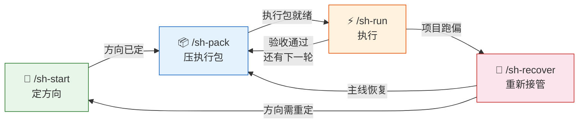

# Superpowers Harness

Superpowers Harness 是一套 4 条命令的工作流，让你驾驭 superpowers 做复杂项目——**不跑偏，有沉淀**。

```
/sh-start   /sh-pack   /sh-run   /sh-recover
```

---

## 没有 Harness 时

| 轮次 | 发生了什么 |
|------|-----------|
| 第 1 轮 | AI 替你定方向、拆阶段，你觉得效率很高 |
| 第 3 轮 | 范围悄悄膨胀，你不太确定现在在做什么了 |
| 第 5 轮 | 功能做完了，但你说不清为什么这么设计 |
| 跑偏时 | 推倒重来，或硬着头皮继续 |

## 有 Harness 时

| 轮次 | 发生了什么 |
|------|-----------|
| 第 1 轮 | 你定方向，AI 给 2-3 条路线比较，你拍板 |
| 第 3 轮 | 每轮一个有边界的执行包，有停机线，偏了立刻识别 |
| 第 5 轮 | 代码 + 决策记录 + 学习沉淀，项目是你的 |
| 跑偏时 | `/sh-recover` 读证据、分主次、恢复主线，接着走 |

---

## 🚫 不跑偏 — AI 始终在你划的边界内推进

复杂项目最常见的失控方式不是做不动，是做着做着方向就糊了：
范围偷偷膨胀、阶段越来越多、文档越写越厚，你从"主导者"变成了"上下文维护员"。

Harness 从四个层面防止跑偏：

| 层面 | 机制 | 对应命令 |
|------|------|----------|
| **方向** | 路线比较 → 你拍板 → 生成决策记录 | `/sh-start` |
| **边界** | 每轮一个执行包，有明确的"不做"清单和停机线 | `/sh-pack` |
| **执行** | 遇到超边界的情况必须停下来汇报，不自作主张 | `/sh-run` |
| **修复** | 跑偏后读证据、区分主线与漂移、恢复方向 | `/sh-recover` |

> 你不需要时刻盯着 AI。你只需要定好边界，Harness 会确保它不越线。

---

## 📘 学习沉淀 — 项目做完，你也真正拥有它

大多数 AI 工作流只关心"做完没有"。Harness 还关心：**做完之后你能不能讲清楚**。

每轮 `/sh-run` 执行结束后，会根据任务复杂度自动生成两种学习记录：

| 任务类型 | 沉淀形式 |
|----------|----------|
| 顺利完成，无重大踩坑 | **踩坑速记**：问题 → 根因 → 解决 → 可复用知识 |
| 经历 ≥2 次尝试，有非显然的技术决策 | **探索旅程**：逐次记录尝试过程和收获，最后提炼可复用知识 |

### 真实示例：踩坑速记

> 场景：给博客系统接入 AI 摘要生成，发布时调 LLM 生成摘要存入数据库。

| 踩坑 | 根因 | 解决 | 可复用知识 |
|------|------|------|------------|
| LLM 摘要长度不稳定，经常超过 150 字 | 模型不严格遵守字数限制 | prompt 加硬约束 + 后端 `slice(0, 150)` 兜底 | 永远不要只靠 prompt 控制输出长度，代码层必须有截断兜底 |
| Markdown 标记污染摘要质量 | 正文含代码块、链接等标记 | 先 strip Markdown 再送 LLM | 喂给 LLM 的内容要预处理，raw Markdown 会污染生成质量 |

### 真实示例：探索旅程

> 场景：给短视频平台接入声音复刻 API，需要破解第三方服务的签名校验。

**第一次尝试：** 直接传空签名调用 API

```
→ 服务端报错：InvalidSignature: HMAC verification failed
→ 收获：从错误信息得知签名算法是 HMAC，不是自定义加密
```

**第二次尝试：** 比对两次合法请求的签名值

```
→ 发现签名长度固定 64 位，且每次不同
→ 推断：HMAC-SHA256，明文包含时间戳等变化参数
```

**第三次尝试：** 从官方 SDK 源码中定位签名逻辑

```
→ SDK 混淆过，直接读不了
→ 换思路：用请求日志反推，发现签名明文 = method + path + timestamp + body_hash
→ 本地复现签名成功，API 调用通过
```

**可复用知识：**

- 签名类报错信息是金矿——它直接告诉你算法类型和校验方式
- 优先从 SDK 或官方文档找签名逻辑，而不是盲猜
- 当 SDK 混淆时，用请求日志反推比硬读代码更高效
- HMAC 签名的明文通常是请求要素的拼接：method + path + timestamp + body

---

这些记录意味着：项目结束后你不只有代码，还有**完整的项目故事**——为什么这么设计、踩了什么坑、关键取舍是什么。

无论是维护、复盘、面试表达，还是知识迁移给团队，这些沉淀都直接可用。

---

## 4 条命令，驱动一次完整的项目周期



| 你的状态 | 用这个 | 产出 |
|----------|--------|------|
| 新项目，方向没定 | `/sh-start` | 路线比较 → 你拍板 → 功能主文档 |
| 方向已定，要开始干活 | `/sh-pack` | 任务列表 + 验收标准 + 停机线 |
| 执行包已有，开始写代码 | `/sh-run` | 实现结果 + 决策记录 + 学习沉淀 |
| 感觉项目跑偏了 | `/sh-recover` | 当前真相 + 漂移识别 + 恢复方案 |

---

## 什么时候需要 Harness，什么时候不需要

**不需要 Harness：**

- 改一个 bug、调一个配置 — 单点修改，直接对话就够
- 写一个工具函数、加一个 API — 边界清晰的单一功能
- "这段代码什么意思" — 局部理解和重构

**需要 Harness 的信号：**

- 你开始觉得"AI 做了很多但我说不清现在在做什么"
- 一个功能已经对话了 3 轮以上还没收敛
- 新项目、大功能、跨模块的复杂需求

---

## 多轮迭代

长期项目会经历多轮 pack → run 循环。何时创建新的 `sh-start`，何时继续 `sh-pack`？ → [多轮迭代指南](docs/iteration-guide.md)

---

## 安装

阅读与你当前工具对应的安装说明：

- [Claude Code 安装说明](.claude/INSTALL.md)
- [Cursor 安装说明](.cursor/INSTALL.md)
- [Codex 安装说明](.codex/INSTALL.md)

> 安装完成？→ [5 分钟快速开始](docs/quick-start.md)

---

## 它和一般 AI 开发流程有什么不同

**一般 AI 工作流：** 尽可能让 AI 自动规划和执行，人负责输入背景和最后验收。

**Harness：** 人定目标、人定边界、人定路线，AI 在边界内高效推进。

|  | 一般 AI 工作流 | Harness |
|--|----------------|---------|
| 谁定方向 | AI | **你** |
| 范围控制 | 容易膨胀 | 每轮有边界和停机线 |
| 跑偏处理 | 推倒或硬撑 | 读证据、识别漂移、恢复主线 |
| 做完之后 | 只有代码 | 代码 + 决策记录 + 学习沉淀 |
| 你的角色 | 上下文维护员 | **项目主导者** |

---

**Superpowers 给你能力。Harness 让你驾驭它。**
